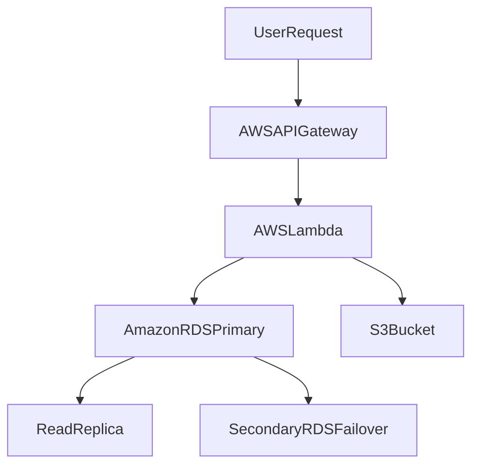

# High-Level Design (HLD) for Lift-and-Shift Migration

## 1. Overview
This High-Level Design (HLD) focuses on migrating a two-tier application composed of two virtual machines, `WebServerVM` and `SQLVM`, to a serverless architecture on AWS. The application will utilize **AWS Lambda** for serverless compute and **Amazon RDS** with **multi-AZ replication** for the database, ensuring high availability and reduced downtime.

## 2. Solution Architecture Diagram

## 3. Target Architecture

The target architecture refactors the existing application into a serverless environment, significantly improving **availability**, **scalability**, and **resilience**. 

### Key Components:
- **AWS Lambda**: Replaces the `WebServerVM` by handling API requests serverlessly. Lambda functions scale automatically based on demand, significantly reducing the chances of downtime due to load issues.
- **Amazon RDS with Multi-AZ Replication**: Replaces `SQLVM` by hosting the MySQL database on Amazon's managed RDS service. Multi-AZ replication ensures that if the primary database instance fails, the system automatically switches to a standby instance in a different availability zone, ensuring minimal downtime.
- **Amazon S3**: Used to store static content (e.g., images, scripts) that were previously handled by the WebServerVM.

### Benefits of Serverless Approach:
1. **Reduced Downtime**: The serverless architecture with AWS Lambda and multi-AZ RDS replication minimizes downtime to under 6 hours as Lambda can auto-recover and RDS provides automatic failover.
2. **Cost Efficiency**: With Lambda’s pay-per-use pricing, costs are reduced by not having to manage and provision dedicated servers.
3. **Scalability**: The application can automatically scale to handle any load due to the serverless nature of AWS Lambda and the managed RDS service.
4. **Simplified Management**: AWS handles the infrastructure, so the focus can be on developing and deploying code, rather than on managing servers and databases.

## 4. Migration Steps

### 4.1 Refactoring the Application to Use AWS Lambda
- Migrate the code running on `WebServerVM` to AWS Lambda.
- Use **AWS API Gateway** to expose the API endpoints to users.
- Configure API Gateway to trigger AWS Lambda functions for compute processing.

### 4.2 Migrating the Database to Amazon RDS
- Export the MySQL database running on `SQLVM`.
- Set up **Amazon RDS** for MySQL with **multi-AZ replication**.
- Import the database dump into RDS and ensure data consistency.

### 4.3 Configuring Failover and Redundancy
- Enable **multi-AZ replication** to ensure that in case of any issues with the primary database, RDS will failover to a secondary instance in another availability zone.
- Configure the necessary **read replicas** for load balancing and backup purposes.

By following these steps, the application can ensure near-zero downtime and the ability to scale dynamically based on traffic or database load.

---

This report ensures a seamless lift-and-shift migration while adhering to high-availability best practices.
