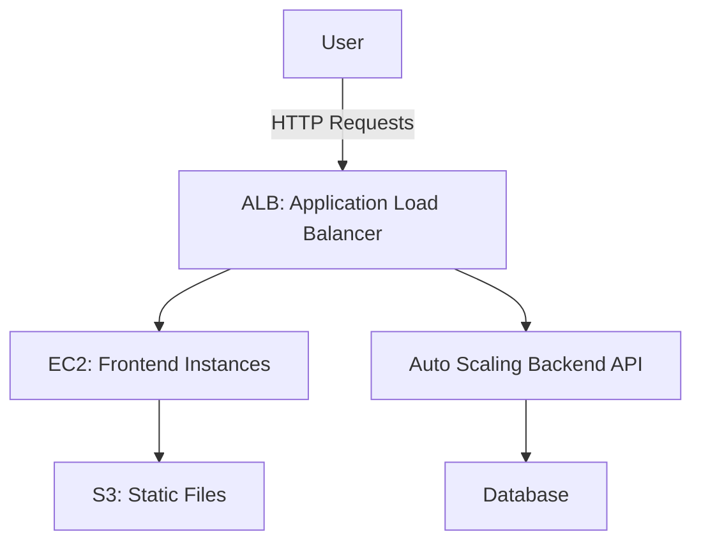

# Lab 5 Report: Rehosting a 3-Tier eCommerce Application to AWS

---

## Objective

In this lab, the goal is to migrate a 3-tier eCommerce application from its current on-premises environment to AWS using a "lift and shift" strategy. The application includes three major components:

- **Frontend Web Server** (currently on WebAppVM).
- **Backend API Server** (currently on APIVM).
- **SQL Database** (currently on DBVM).

Key requirements for this migration include ensuring that load balancing and auto-scaling are in place, maintaining data consistency, and minimizing downtime to less than two hours.

---

## AWS Services Used

1. **Amazon EC2**:
   - **What it does**: EC2 is where we’ll be rehosting both the frontend and backend servers (WebAppVM and APIVM). It provides flexible, scalable compute capacity for the application’s needs.
   - **Frontend Setup**: EC2 instances will be used to host the frontend behind an **Application Load Balancer** (ALB) to distribute traffic.
   - **Backend Setup**: The API server will also run on EC2 and use **Auto Scaling** to adjust resources based on demand.

2. **Amazon RDS**:
   - **What it does**: Amazon RDS is used for managing the SQL database. It takes over tasks like backups, software patching, and automatic failover.
   - **Key Feature**: A Multi-AZ (availability zone) configuration ensures that if one data center experiences downtime, another instance can take over.

3. **AWS Application Load Balancer (ALB)**:
   - **What it does**: ALB is responsible for routing traffic evenly across multiple frontend instances. This helps ensure that no single server gets overloaded with requests, keeping the application available and responsive.

4. **Auto Scaling**:
   - **What it does**: Auto Scaling helps to automatically increase or decrease the number of backend instances (APIVM) based on traffic. This ensures the application has just enough resources to handle traffic without wasting money on idle servers.

5. **Amazon S3**:
   - **What it does**: S3 is used for storing static assets, backups, and files related to the migration process.
   - **Key Feature**: It also plays a role in migrating data from on-premises to AWS, acting as a temporary storage location.

---

## Migration Process Overview

1. **Pre-Migration Steps**:
   - Assess the on-premises environment to understand what components need to be moved.
   - Configure AWS networking (VPC, subnets, security groups) to support the new infrastructure.
   - Design the architecture with high availability in mind using multiple availability zones.

2. **Migrating the Frontend**:
   - Spin up EC2 instances and place them behind the ALB.
   - Move static content over to S3, and point the web app to fetch those files from there.
   - Set up Auto Scaling to dynamically adjust the number of frontend instances based on traffic.

3. **Migrating the Backend**:
   - Rehost the API server (APIVM) on EC2 instances.
   - Configure Auto Scaling for the backend to handle variable traffic loads.
   - Set up health checks to make sure that unhealthy instances are replaced automatically.

4. **Database Migration**:
   - Migrate the SQL database (DBVM) to Amazon RDS.
   - Use AWS Database Migration Service (DMS) for continuous replication to minimize downtime during the migration.
   - Enable Multi-AZ in RDS for high availability, ensuring no data is lost if one server fails.

5. **Testing**:
   - Test the setup in a staging environment before production.
   - Verify that the entire application (frontend, backend, and database) is functioning as expected.
   - Perform data consistency checks to ensure all data has been properly migrated.

6. **Cutover and Rollback Plan**:
   - Schedule the switch to AWS during off-peak hours.
   - If something goes wrong, revert traffic back to the on-premises environment, minimizing downtime and disruption.

---

## Data Consistency Strategy

To ensure that data is consistent during migration, we use **AWS Database Migration Service (DMS)** for real-time replication between the on-premises database and the Amazon RDS instance. This allows the migration to happen without shutting down the current database, so users can continue accessing the application during the move.

- **Backup Strategy**: Before migration starts, full backups of the SQL database are created to prevent any data loss.
- **Data Verification**: After the migration, thorough checks are performed to ensure that no data is missing or corrupted.

---

## Minimizing Downtime

1. **Live Data Replication**: By using AWS DMS, changes in the database are replicated in real-time, which means the application can stay online while the data is being copied to the cloud.
2. **Gradual Traffic Shift**: The final switch to AWS is done in phases, gradually redirecting traffic to the new infrastructure. This ensures that any issues can be caught and dealt with before the full transition.
3. **Failover Plan**: If any part of the migration fails, we can quickly fall back to the original on-premises environment, minimizing any potential downtime.

---

## Architecture Diagram

---

## Scalability, Availability, and Disaster Recovery

1. **Scalability**: Auto Scaling is set up for both the frontend and backend, ensuring that the system can automatically scale up or down based on traffic, helping keep costs down and performance up.
2. **Availability**: ALB and RDS with Multi-AZ configuration ensure the system remains available even if one instance or an entire availability zone fails.
3. **Disaster Recovery**: Regular backups of the data are stored in S3, ensuring a quick recovery in case of a disaster.

---

## Conclusion

This lab demonstrated how to successfully migrate a 3-tier eCommerce application to AWS using EC2, ALB, RDS, and other services. The architecture we designed ensures scalability, high availability, and data consistency, while the migration process kept downtime to a minimum.
